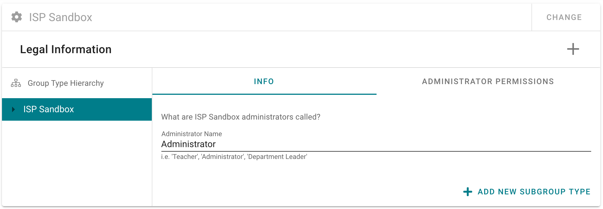

# Creating and Configuring an Organisation

> If you notice any missing data, you can click the refresh icon in the top left of the toolbar.

Navigate to the **ORGANISATION** page using the sidebar menu. If your organisation hasn't already been set up, you can add one by clicking the  add button.

Click on your newly created Organisation.

First you have to set up the permissions for your top level ORGANISATION. Top level organisations do not have regular members, but they do have administrators. Call them Administrator. You can leave the default permissions alone for now.

> If your organisation contains a number of smaller, independently operated organisations (such as a Local Authority or MAT containing schools, or a Company containing independently operated franchises), you do not need to uncheck 'Inherit Read Access' and 'Inherit Write Access' in Administrator Permissions. Child Organisations of your Parent Organisation should independently set up their own organisational hierarchies, to which you will not have automatic access.

## Creating Subgroups

Right now, you only have a top level group--your Organisation. To add a Group Type to your hierarchy, (such as a department, office or school), click 'ADD NEW SUBGROUP TYPE'.

> You are **not** adding specific groups at this time. So, if you're a school you might add a **Sub Group Type** called 'Key Stage', 'College', or 'Teaching Department' (or all three), but not 'Key Stage 4', 'Science' or 'MFL'.

If you are a parent organisation that has a lot of smaller, independently operated organisations (such as a Local Authority, MAT, or Parent Company), your Org Structure might look like this:
- Parent Company
  - Office (Make sure you check the box labeled 'Organisation')--that will allow Administrators of each Office you create to define their own hierarchies that reflect the individual Office.
  - Internal Department
  - Working Group
  - Customer Group

You can find more information about setting up Permissions [here](/management-portal/permissions.md). The default values err on the side of being conservative, so you can probably leave them alone.

> Groups do not necessarily have to be comprised of employees or direct members of the organisation. A Customer Group Type could include Groups such as Potential Customers or Users. Similarly a Stakeholder Group Type in a school might have Groups such as Parents, Governors,  or Inspection Bodies.

> Since an Person's access is determined by the Group(s) they belong to, this is safe to do as long as permissions on that group are correctly configured.

---

## Adding People

Navigate to the **PEOPLE**  page using the sidebar menu.

Here you will see a list of all people that belong to the Organisations you control as an administrator.

> The Add Person form is v. ugly, I will fix that.

For now, you can add people one at a time to any of the organisations you control.

Click on the Add tab, and enter a minimum of First Name, Last Name and ensure that the correct Organisation(s) is selected. A Person can be a member of several different Organisations. the If you add a valid email address, you will have the option to invite this Person to create an account on SmartRubric Assessment Core. You can also do that later from the list or on the user's profile page.

### Removing PEOPLE

A person that does not have an account can be deleted from the People page. If you are allowed to delete them, you will see a 'DELETE' button next to their name. You can only Delete a Person record if the following is true:

  - You are an administrator of all of the Organisations the Person belongs to
  - The Person does not have a User Account

If you can't delete the Person, you can still remove them from your Organisation or Revoke their User Account Access.

---

## Adding Groups

Navigate to the **GROUPS** page using the sidebar menu.

As an Organisation Administrator, you can create Groups in two ways. You can quickly add a Group to one of your Organisations from the GROUPS page, or you can navigate to an existing Group and add a sub Group.

### Adding People to Groups

Once you have created a new Group you can manage the members in that group, if you have [permissions](/management-portal/permissions.md) to do so.
